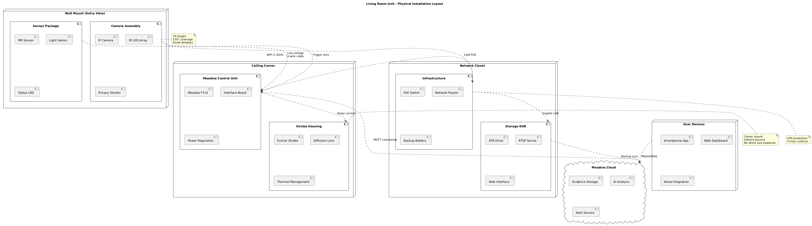

# Meadow-Based Living Room Camera Unit UML Design

## Component Architecture

The living room unit combines motion detection with evidence capture, using Meadow F7's processing power to coordinate PIR sensors, strobe deterrents, and camera recording through sophisticated GPIO management.

The component architecture prioritizes evidence capture with local storage redundancy. The camera trigger interface converts Meadow's 3.3V signals to camera-compatible dry contacts. The ambient light sensor enables intelligent IR illuminator control, activating only when needed to avoid overexposure. Image processing occurs on-device for motion detection zones and preliminary threat assessment before cloud upload.

## Class Structure

The object model emphasizes image capture and processing capabilities while maintaining the modular deterrent architecture established in the attic unit.

The class structure separates image capture from processing, enabling different camera types through the `IImageCapture` interface. The `MotionZoneProcessor` implements intelligent motion detection within defined regions, reducing false triggers from areas like windows. The `StorageService` manages limited SD card space through rolling deletion of uploaded content. Cloud upload occurs asynchronously with retry logic for network failures.

## Evidence Capture Sequence

The sequence demonstrates coordinated capture with pre-event buffering, ensuring complete documentation of intrusion attempts.

The sequence implements a sophisticated capture strategy with continuous pre-buffering ensuring events leading to motion detection are recorded. The 5-second ring buffer captures approach behavior before PIR triggering. Parallel processing handles evidence collection while maintaining real-time deterrent activation. High-resolution snapshots every 2 seconds provide clear identification even if video compression affects quality. Cloud upload occurs after local storage to prevent network delays from affecting capture.

## State Management

The state machine incorporates capture-specific states while maintaining compatibility with the broader security system architecture.

The state machine balances evidence quality with storage constraints. Pre-buffering states maintain a rolling window of low-resolution footage without filling storage. The capture sequence ensures all evidence is secured before attempting uploads, preventing data loss from network issues. Local mode provides degraded but functional operation during internet outages, with intelligent storage management preventing SD card overflow.

## Physical Deployment

The deployment layout optimizes camera coverage while maintaining discrete installation appropriate for living spaces.

Living room deployment requires aesthetic considerations alongside functionality. Wall-mounted sensors blend with modern home decor while maintaining optimal detection angles. The camera's 7-foot mounting height prevents tampering while providing comprehensive room coverage. Privacy shutters address resident concerns about continuous monitoring. Strobe positioning uses indirect lighting to avoid disorienting residents while maintaining effectiveness against intruders. Network infrastructure in a separate closet reduces electromagnetic interference and provides physical security for recording equipment. The PoE camera connection simplifies installation while providing reliable power and data through a single cable.
