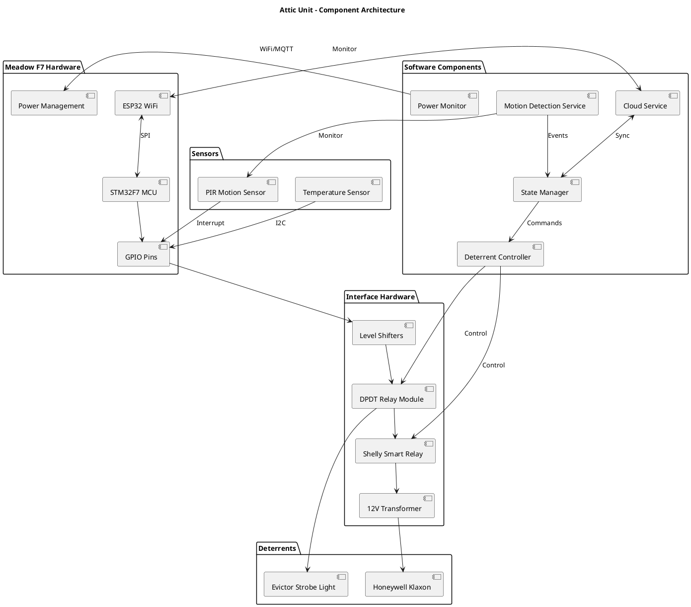
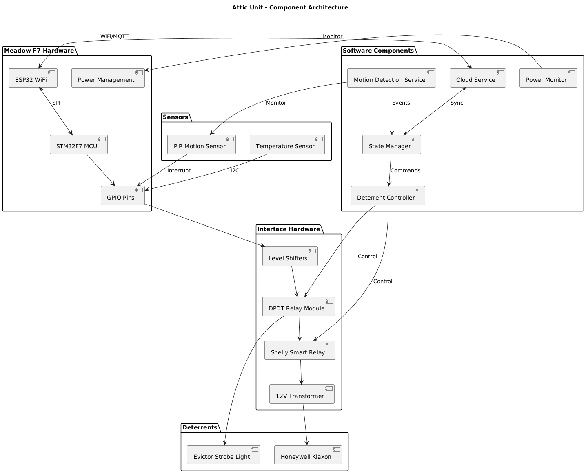
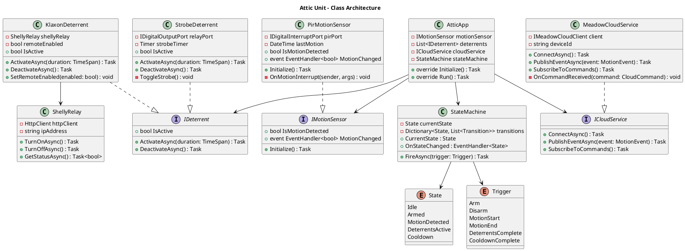
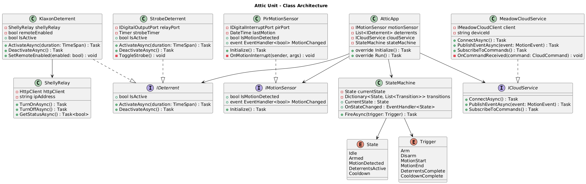
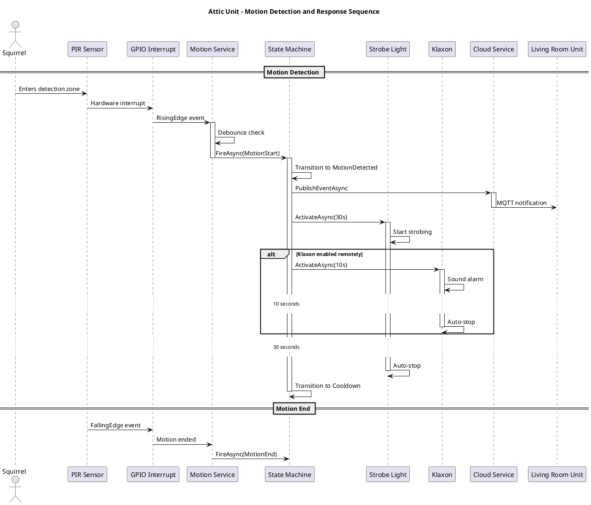
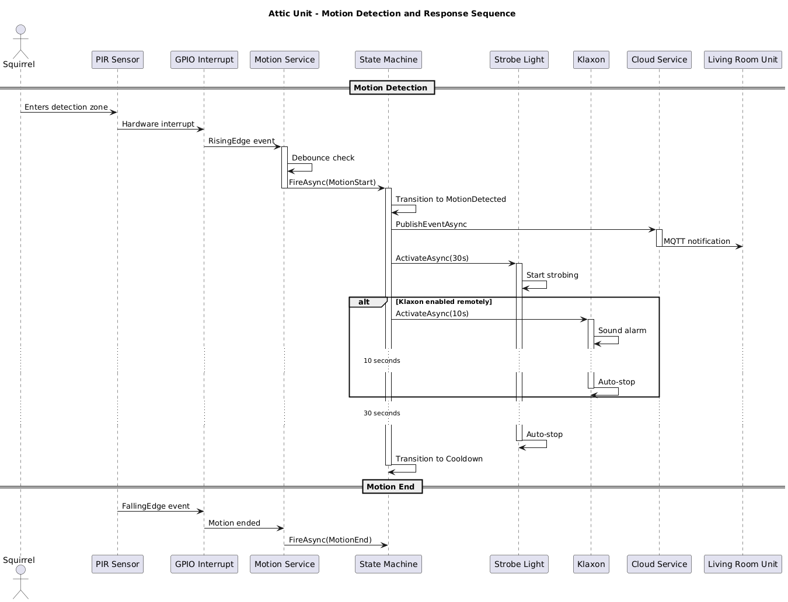
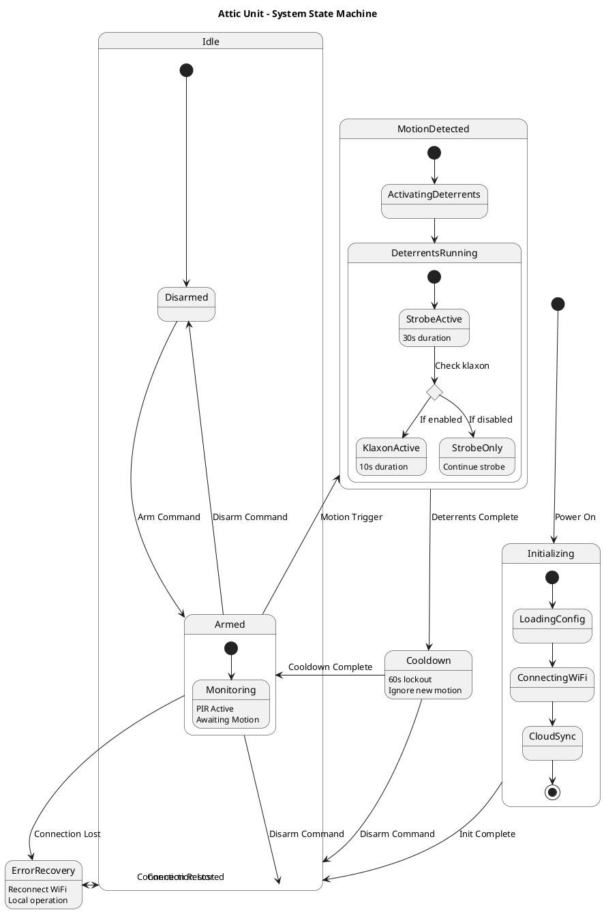
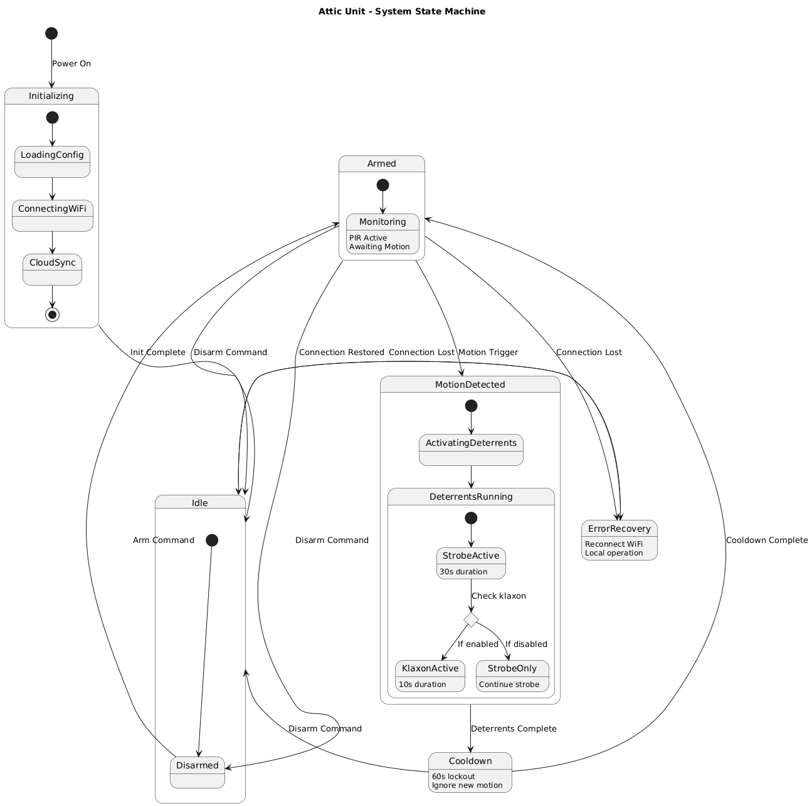
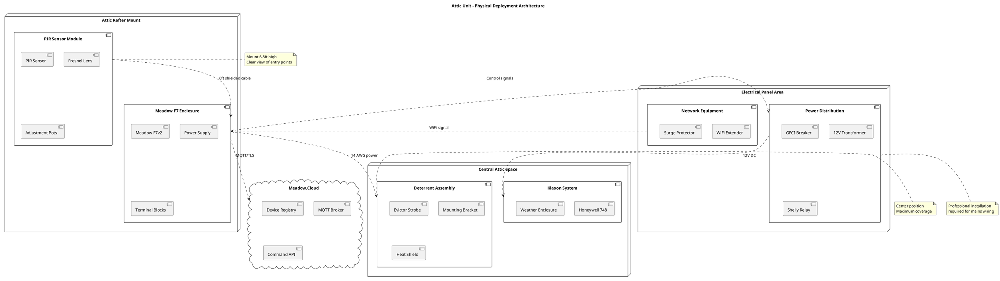
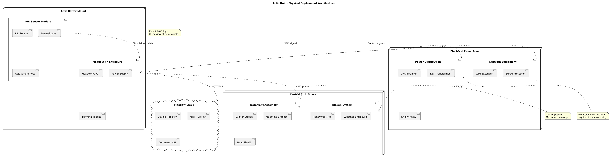

# Meadow-Based Attic Deterrent Unit UML Design

## Component Architecture

The attic unit leverages Meadow F7's GPIO capabilities to control high-power deterrents through relay interfaces, with cloud connectivity enabling remote management and coordination with other units.

This component diagram illustrates the hardware abstraction layers and software services. The Meadow F7's GPIO pins interface with sensors and control relays through level shifters to handle voltage differences. The ESP32 coprocessor manages network connectivity independently, ensuring reliable cloud communication. Software components follow a service-oriented architecture with clear separation between detection, control, and communication responsibilities.

## Class Structure

The object-oriented design leverages C# interfaces and async patterns to create maintainable, testable code that maximizes Meadow.Foundation's capabilities.

The class architecture employs dependency injection through interfaces, enabling unit testing and component substitution. The `AtticApp` class inherits from Meadow's base application class, overriding initialization and run methods. Deterrent classes encapsulate hardware control logic, while the state machine ensures predictable system behavior. The `ShellyRelay` class demonstrates HTTP-based control of smart devices, extending the system's capabilities beyond direct GPIO control.

## Motion Detection Sequence

The sequence flow demonstrates interrupt-driven motion detection with cloud-coordinated responses, showcasing Meadow's event-driven architecture.

The sequence leverages hardware interrupts for immediate response to motion events. The GPIO interrupt handler executes in microseconds, triggering the motion service which performs software debouncing to prevent false triggers. State machine transitions ensure deterrents activate in the correct sequence, with the strobe light providing immediate visual deterrence while the klaxon depends on remote enablement. Cloud notifications enable cross-unit coordination, allowing the living room camera to begin recording simultaneously.

## State Management

The state machine provides deterministic behavior with clear transitions between operational modes, essential for reliable security systems.

The hierarchical state machine manages system complexity through nested states and guarded transitions. The initialization sequence ensures all components are ready before entering operational states. The cooldown period prevents rapid retriggering that could annoy neighbors or drain power. Error recovery states maintain local functionality during network outages, with the system continuing to respond to motion events even without cloud connectivity. State persistence across power cycles ensures the system returns to its previous armed/disarmed state.

## Physical Deployment

The deployment architecture shows the practical installation layout with proper component placement for optimal coverage and maintenance access.

Physical deployment considerations include mounting the PIR sensor at optimal height (6-8 feet) with clear sightlines to potential entry points. The Meadow F7 enclosure requires adequate ventilation despite attic temperature extremes. Shielded cables prevent electromagnetic interference from affecting PIR sensor signals. The strobe light's central positioning maximizes its disorienting effect throughout the attic space. Professional electrical installation ensures code compliance for mains voltage connections, while low-voltage wiring to sensors and the klaxon can be self-installed. WiFi coverage often requires an extender in attic installations due to signal attenuation through building materials.
