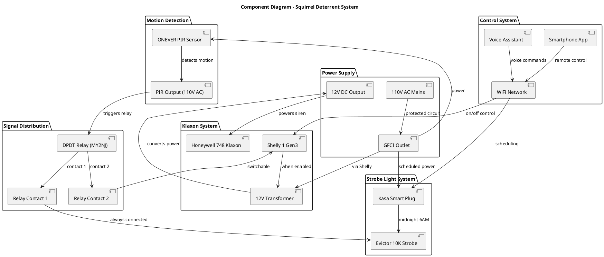
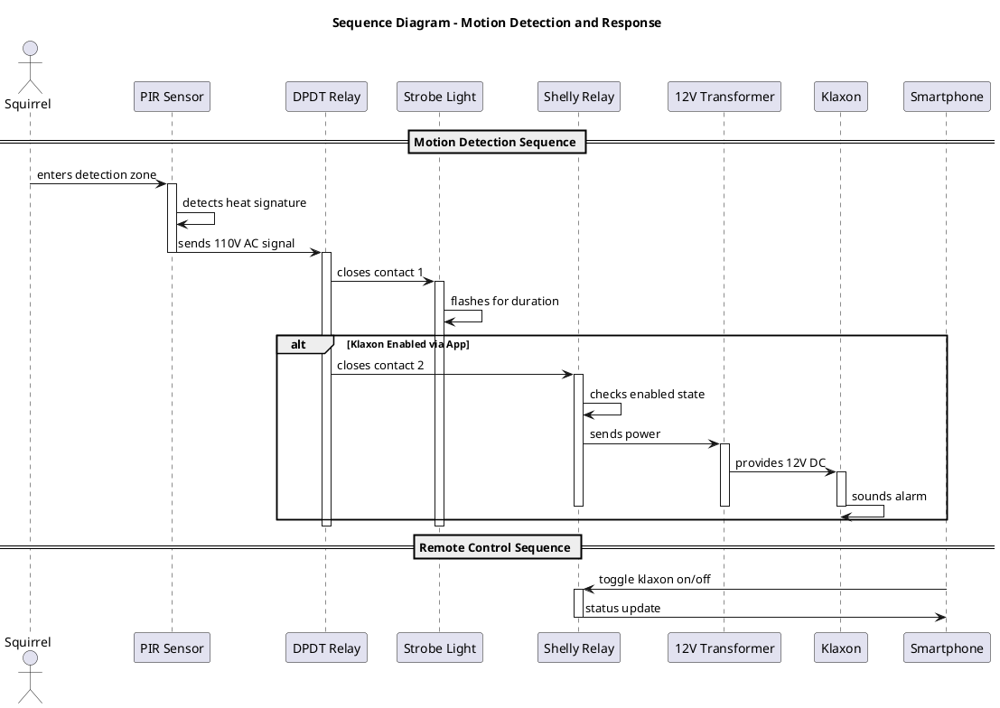
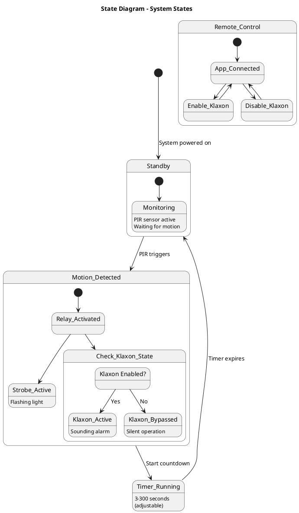
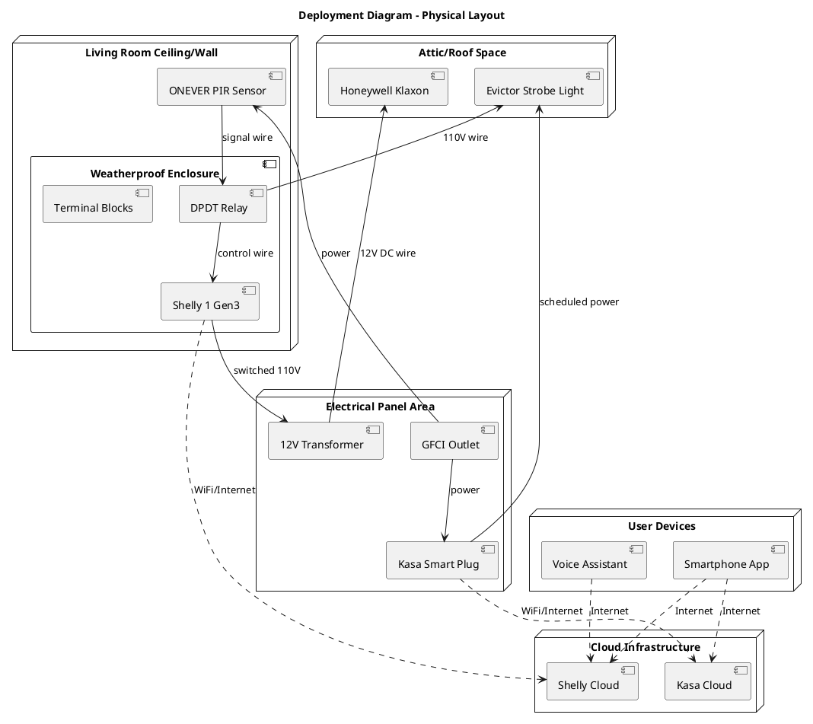
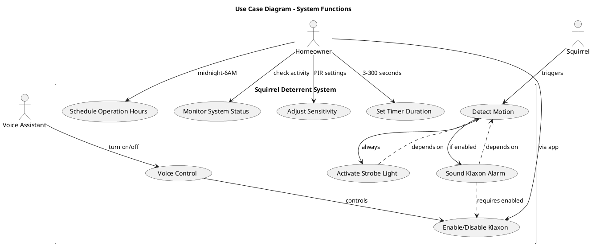
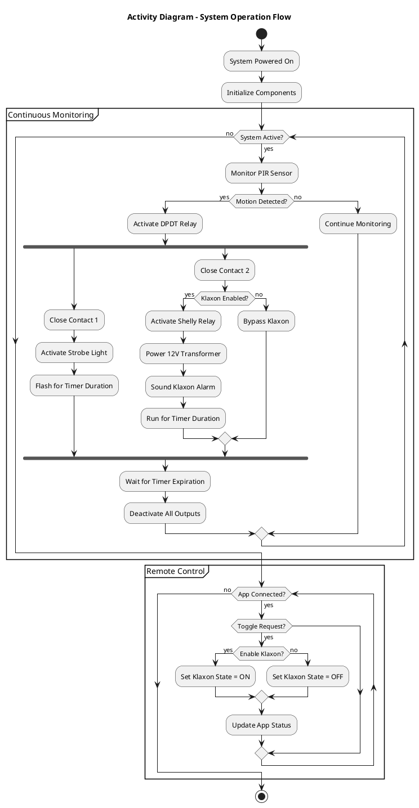

# Squirrel Deterrent System Diagrams

```plantuml

@startuml Component_Diagram
!define RECTANGLE class

title Component Diagram - Squirrel Deterrent System

package "Motion Detection" {
  [ONEVER PIR Sensor] as PIR
  [PIR Output (110V AC)] as PIROut
}

package "Signal Distribution" {
  [DPDT Relay (MY2NJ)] as DPDT
  [Relay Contact 1] as RC1
  [Relay Contact 2] as RC2
}

package "Strobe Light System" {
  [Evictor 10K Strobe] as Strobe
  [Kasa Smart Plug] as KasaPlug
}

package "Klaxon System" {
  [Shelly 1 Gen3] as Shelly
  [12V Transformer] as Transformer
  [Honeywell 748 Klaxon] as Klaxon
}

package "Control System" {
  [Smartphone App] as App
  [Voice Assistant] as Voice
  [WiFi Network] as WiFi
}

package "Power Supply" {
  [110V AC Mains] as Mains
  [GFCI Outlet] as GFCI
  [12V DC Output] as DC12V
}

' Connections
PIR --> PIROut : detects motion
PIROut --> DPDT : triggers relay
DPDT --> RC1 : contact 1
DPDT --> RC2 : contact 2
RC1 --> Strobe : always connected
RC2 --> Shelly : switchable
Shelly --> Transformer : when enabled
Transformer --> DC12V : converts power
DC12V --> Klaxon : powers siren

Mains --> GFCI : protected circuit
GFCI --> PIR : power
GFCI --> KasaPlug : scheduled power
KasaPlug --> Strobe : midnight-6AM
GFCI --> Transformer : via Shelly

App --> WiFi : remote control
Voice --> WiFi : voice commands
WiFi --> Shelly : on/off control
WiFi --> KasaPlug : scheduling

@enduml

```  
  

```plantuml  

@startuml Sequence_Diagram
title Sequence Diagram - Motion Detection and Response

actor Squirrel
participant "PIR Sensor" as PIR
participant "DPDT Relay" as DPDT
participant "Strobe Light" as Strobe
participant "Shelly Relay" as Shelly
participant "12V Transformer" as Trans
participant "Klaxon" as Klaxon
participant "Smartphone" as Phone

== Motion Detection Sequence ==
Squirrel -> PIR : enters detection zone
activate PIR
PIR -> PIR : detects heat signature
PIR -> DPDT : sends 110V AC signal
deactivate PIR

activate DPDT
DPDT -> Strobe : closes contact 1
activate Strobe
Strobe -> Strobe : flashes for duration

alt Klaxon Enabled via App
  DPDT -> Shelly : closes contact 2
  activate Shelly
  Shelly -> Shelly : checks enabled state
  Shelly -> Trans : sends power
  activate Trans
  Trans -> Klaxon : provides 12V DC
  activate Klaxon
  Klaxon -> Klaxon : sounds alarm
  deactivate Klaxon
  deactivate Trans
  deactivate Shelly
end

deactivate Strobe
deactivate DPDT

== Remote Control Sequence ==
Phone -> Shelly : toggle klaxon on/off
activate Shelly
Shelly -> Phone : status update
deactivate Shelly

@enduml
```

```plantuml
@startuml State_Diagram
title State Diagram - System States

[*] --> Standby : System powered on

state Standby {
  [*] --> Monitoring
  Monitoring : PIR sensor active
  Monitoring : Waiting for motion
}

Standby --> Motion_Detected : PIR triggers

state Motion_Detected {
  [*] --> Relay_Activated
  Relay_Activated --> Strobe_Active
  Relay_Activated --> Check_Klaxon_State
  
  state Check_Klaxon_State {
    state "Klaxon Enabled?" as KE
    KE --> Klaxon_Active : Yes
    KE --> Klaxon_Bypassed : No
  }
  
  Strobe_Active : Flashing light
  Klaxon_Active : Sounding alarm
  Klaxon_Bypassed : Silent operation
}

Motion_Detected --> Timer_Running : Start countdown

state Timer_Running {
  Timer_Running : 3-300 seconds
  Timer_Running : (adjustable)
}

Timer_Running --> Standby : Timer expires

state Remote_Control {
  [*] --> App_Connected
  App_Connected --> Enable_Klaxon
  App_Connected --> Disable_Klaxon
  Enable_Klaxon --> App_Connected
  Disable_Klaxon --> App_Connected
}

@enduml
```  
  

```plantuml  
@startuml Deployment_Diagram
title Deployment Diagram - Physical Layout

node "Living Room Ceiling/Wall" as Indoor {
  component "ONEVER PIR Sensor" as PIR
  component "Weatherproof Enclosure" as WPE {
    component "DPDT Relay" as DPDT
    component "Shelly 1 Gen3" as Shelly
    component "Terminal Blocks" as TB
  }
}

node "Attic/Roof Space" as Attic {
  component "Evictor Strobe Light" as Strobe
  component "Honeywell Klaxon" as Klaxon
}

node "Electrical Panel Area" as Electric {
  component "GFCI Outlet" as GFCI
  component "12V Transformer" as Trans
  component "Kasa Smart Plug" as Kasa
}

node "Cloud Infrastructure" as Cloud {
  component "Shelly Cloud" as SCloud
  component "Kasa Cloud" as KCloud
}

node "User Devices" as User {
  component "Smartphone App" as App
  component "Voice Assistant" as Voice
}

' Physical connections
PIR -down-> DPDT : "signal wire"
DPDT -up-> Strobe : "110V wire"
DPDT -down-> Shelly : "control wire"
Shelly -down-> Trans : "switched 110V"
Trans -up-> Klaxon : "12V DC wire"
GFCI -up-> PIR : "power"
GFCI --> Kasa : "power"
Kasa -up-> Strobe : "scheduled power"

' Network connections
Shelly ..> SCloud : "WiFi/Internet"
Kasa ..> KCloud : "WiFi/Internet"
App ..> SCloud : "Internet"
App ..> KCloud : "Internet"
Voice ..> SCloud : "Internet"

@enduml
```  
  

```plantuml  
@startuml Use_Case_Diagram
title Use Case Diagram - System Functions

actor "Homeowner" as Owner
actor "Squirrel" as Squirrel
actor "Voice Assistant" as Alexa

rectangle "Squirrel Deterrent System" {
  usecase "Detect Motion" as UC1
  usecase "Activate Strobe Light" as UC2
  usecase "Sound Klaxon Alarm" as UC3
  usecase "Enable/Disable Klaxon" as UC4
  usecase "Schedule Operation Hours" as UC5
  usecase "Monitor System Status" as UC6
  usecase "Adjust Sensitivity" as UC7
  usecase "Set Timer Duration" as UC8
  usecase "Voice Control" as UC9
}

Squirrel --> UC1 : triggers
UC1 --> UC2 : always
UC1 --> UC3 : if enabled

Owner --> UC4 : via app
Owner --> UC5 : midnight-6AM
Owner --> UC6 : check activity
Owner --> UC7 : PIR settings
Owner --> UC8 : 3-300 seconds

Alexa --> UC9 : "turn on/off"
UC9 --> UC4 : controls

UC2 ..> UC1 : depends on
UC3 ..> UC1 : depends on
UC3 ..> UC4 : requires enabled

@enduml
```  
  

```plantuml  
@startuml Activity_Diagram
title Activity Diagram - System Operation Flow

start
:System Powered On;
:Initialize Components;

partition "Continuous Monitoring" {
  while (System Active?) is (yes)
    :Monitor PIR Sensor;
    
    if (Motion Detected?) then (yes)
      :Activate DPDT Relay;
      
      fork
        :Close Contact 1;
        :Activate Strobe Light;
        :Flash for Timer Duration;
      fork again
        :Close Contact 2;
        if (Klaxon Enabled?) then (yes)
          :Activate Shelly Relay;
          :Power 12V Transformer;
          :Sound Klaxon Alarm;
          :Run for Timer Duration;
        else (no)
          :Bypass Klaxon;
        endif
      end fork
      
      :Wait for Timer Expiration;
      :Deactivate All Outputs;
      
    else (no)
      :Continue Monitoring;
    endif
    
  endwhile (no)
}

partition "Remote Control" {
  while (App Connected?) is (yes)
    if (Toggle Request?) then (yes)
      if (Enable Klaxon?) then (yes)
        :Set Klaxon State = ON;
      else (no)
        :Set Klaxon State = OFF;
      endif
      :Update App Status;
    endif
  endwhile (no)
}

stop

@enduml
```  
  

